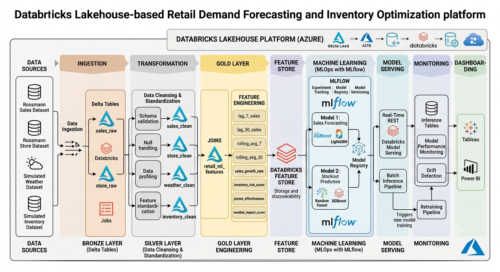

# Retail Demand Forecasting & Inventory Optimization using Databricks Lakehouse

## Overview

This project demonstrates an end-to-end Retail Analytics and MLOps platform built on Databricks using the Medallion Architecture (Bronze → Silver → Gold).

The solution ingests retail sales data, enriches it with weather and inventory information, performs feature engineering, and prepares production-ready datasets for machine learning, model serving, and monitoring.

The project follows real-world Data Engineering, Analytics Engineering, and MLOps practices commonly used in enterprise retail organizations.

---

## Business Problem

Retail organizations face several challenges:

* Demand forecasting
* Inventory optimization
* Stockout prediction
* Promotion effectiveness analysis
* Seasonal demand fluctuations
* Weather-driven sales variation

The objective of this project is to build a scalable Lakehouse platform capable of supporting advanced analytics and machine learning use cases.

---

## Solution Architecture



---

## Technology Stack

| Category           | Technology               |
| ------------------ | ------------------------ |
| Data Platform      | Databricks               |
| Processing Engine  | Apache Spark             |
| Storage Layer      | Delta Lake               |
| Catalog            | Unity Catalog            |
| Language           | Python, PySpark          |
| ML Tracking        | MLflow                   |
| Feature Management | Databricks Feature Store |
| Model Serving      | Databricks Model Serving |
| Version Control    | GitHub                   |

---

## Dataset

### Rossmann Store Sales Dataset

The dataset contains historical sales records for 1,115 retail stores.

Key attributes include:

* Store
* Sales
* Customers
* Promotions
* Holidays
* Store Information
* Competition Information

### Simulated Weather Dataset

Additional external features were generated:

* Temperature
* Humidity
* Rainfall
* Weather Condition

### Simulated Inventory Dataset

Inventory features were generated to support stockout prediction:

* Inventory On Hand
* Safety Stock
* Reorder Point
* Inventory Coverage
* Stockout Flag

---

# Medallion Architecture

## Bronze Layer

Raw ingestion layer.

### Tables

* sales_raw
* store_raw

### Activities

* CSV ingestion
* Schema validation
* Raw data storage
* Data quality assessment

---

## Silver Layer

Data cleansing and standardization layer.

### Tables

* sales_clean
* store_clean
* weather_clean
* inventory_clean

### Activities

* Null handling
* Data validation
* Standardization
* Derived business attributes
* Inventory simulation
* Weather data generation

---

## Gold Layer

Business-ready analytical layer.

### Table

* retail_ml_features

### Data Sources Combined

* Sales Data
* Store Data
* Weather Data
* Inventory Data

### Purpose

Single source of truth for analytics and machine learning workloads.

---

# Current Data Pipeline

```text
Rossmann Sales Data
        |
        v
+----------------+
| Bronze Layer   |
| sales_raw      |
| store_raw      |
+----------------+
        |
        v
+----------------+
| Silver Layer   |
| sales_clean    |
| store_clean    |
| weather_clean  |
| inventory_clean|
+----------------+
        |
        v
+---------------------------+
| Gold Layer                |
| retail_ml_features        |
+---------------------------+
```

---

# Data Model

The Gold Layer contains:

### Sales Features

* Sales
* Customers
* Promo
* Open
* SchoolHoliday
* StateHoliday

### Calendar Features

* DayOfWeek
* Week
* Month
* Quarter
* Year

### Store Features

* Competition Distance
* Promo2 Information
* Store Type
* Assortment Type

### Weather Features

* Temperature
* Humidity
* Rainfall
* Weather Condition

### Inventory Features

* Inventory On Hand
* Safety Stock
* Reorder Point
* Inventory Coverage
* Stockout Flag

---

# Project Structure

```text
retail-demand-forecasting-mlops/
│
├── README.md
│
├── architecture/
│   └── solution_architecture.png
│
├── notebooks/
│   ├── 01_bronze_ingestion.py
│   ├── 02_data_profiling.py
│   ├── 03_silver_layer.py
│   ├── 04_weather_generation.py
│   ├── 05_inventory_generation.py
│   ├── 06_gold_layer.py
│
├── docs/
│   ├── data_dictionary.md
│   ├── project_scope.md
│   └── design_decisions.md
│
├── screenshots/
│   ├── bronze_layer.png
│   ├── silver_layer.png
│   ├── gold_layer.png
│   └── unity_catalog.png
│
└── datasets/
```

---

# Project Progress

## Completed

### Data Engineering

* Bronze Layer Creation
* Data Profiling
* Silver Layer Development
* Weather Dataset Generation
* Inventory Dataset Generation
* Gold Layer Development

### Lakehouse Architecture

* Unity Catalog Setup
* Delta Table Creation
* Medallion Architecture Implementation

---

## Upcoming Work

### Feature Engineering

* Lag Features
* Rolling Averages
* Trend Features
* Inventory Risk Features
* Weather Impact Features

### Machine Learning

#### Sales Forecasting

Algorithms:

* XGBoost
* LightGBM

#### Stockout Prediction

Algorithms:

* Random Forest
* XGBoost

### MLOps

* MLflow Tracking
* Model Registry
* Feature Store
* Batch Inference
* Real-Time Serving
* Inference Tables
* Drift Detection
* Automated Retraining

---

# Future Architecture

```text
Gold Layer
      |
      v
Feature Engineering
      |
      v
Feature Store
      |
      v
ML Training
      |
      v
MLflow Tracking
      |
      v
Model Registry
      |
      v
Model Serving
      |
      v
Inference Monitoring
```

---

# Key Learning Outcomes

This project demonstrates:

* Databricks Lakehouse Architecture
* Delta Lake
* Unity Catalog
* PySpark Transformations
* Data Engineering Best Practices
* Feature Engineering
* Machine Learning Pipelines
* MLOps Concepts
* Model Serving and Monitoring

---

# Author

**HARINI H**

Aspiring Data Scientist | Data Engineer | ML Engineer

GitHub: https://github.com/harinihari121203
